# 

The Forge is a cross-platform rendering framework supporting
- PC 
  * Windows 10 
     * with DirectX 12 / Vulkan 1.1
     * with DirectX Ray Tracing API
     * DirectX 11 Fallback Layer for Windows 7 support (not extensively tested)
  * Linux Ubuntu 18.04 LTS with Vulkan 1.1 and RTX Ray Tracing API
- Android Pie with Vulkan 1.1
- macOS / iOS / iPad OS with Metal 2.2
- XBOX One / XBOX One X (only available for accredited developers on request)
- PS4 / PS4 Pro (only available for accredited developers on request)
- Switch (in development) (only available for accredited developers on request)
- Google Stadia (in development) (only available for accredited developers on request)

Particularly, the graphics layer of The Forge supports cross-platform
- Descriptor management
- Multi-threaded and asynchronous resource loading
- Shader reflection
- Multi-threaded command buffer generation

The Forge can be used to provide the rendering layer for custom next-gen game engines. It is also meant to provide building blocks to write your own game engine. It is like a "lego" set that allows you to use pieces to build a game engine quickly. The "lego" High-Level Features supported on all platforms are at the moment:
- Asynchronous Resource loading with a resource loader task system as shown in 10_PixelProjectedReflections
- [Lua Scripting System](https://www.lua.org/) - currently used in 06_Playground to load models and textures and animate the camera
- Animation System based on [Ozz Animation System](https://github.com/guillaumeblanc/ozz-animation)
- Consistent Math Library  based on an extended version of [Vectormath](https://github.com/glampert/vectormath) with NEON intrinsics for mobile platforms
- Extended version of [EASTL](https://github.com/electronicarts/EASTL/)
- For loading art assets we have a modified and integrated version of [Assimp](https://github.com/assimp/assimp)
- Consistent Memory Managament: 
  * on GPU following [Vulkan Memory Allocator](https://github.com/GPUOpen-LibrariesAndSDKs/VulkanMemoryAllocator)
  * on CPU [Fluid Studios Memory Manager](http://www.paulnettle.com/)
- Input system with Gestures for Touch devices based on an extended version of [gainput](https://github.com/jkuhlmann/gainput)
- Fast Entity Component System based on our internally developed ECS
- UI system based on [imGui](https://github.com/ocornut/imgui) with a dedicated unit test extended for touch input devices
- Audio based on integrating [SoLoud](https://github.com/jarikomppa/soloud)
- Various implementations of high-end Graphics Effects as shown in the unit tests below

Please find a link and credits for all open-source packages used at the end of this readme.

<a href="https://discord.gg/hJS54bz" target="_blank"> Join the Discord channel at https://discord.gg/hJS54bz</a>

<a href="https://twitter.com/TheForge_FX?lang=en" target="_blank"> Join the channel at https://twitter.com/TheForge_FX?lang=en</a>
 

# Build Status 

* Windows [](https://ci.appveyor.com/project/wolfgangfengel/the-forge/branch/master)
* macOS [](https://travis-ci.org/ConfettiFX/The-Forge)

# News

## Release 1.32 - August 9th - Ephemeris Night Sky update | New Light and Shadow Playground | Android Visual Studio Support
* [Ephemeris - Skydome System](https://github.com/ConfettiFX/Custom-Middleware) 
  * Added Procedural Night Sky and Star-field - the night sky's nebula colors are now customizable
  * Added Glow effects on Sun and Moon
  * Fix the issue that Godrays can be drawn on unexpected area

Click on the following screenshot to see a movie:

 [](https://vimeo.com/352541826)

* New Light and Shadow Playground: we rebuild the light and shadow playground by using the St. Miguel art assets and adding some new shadowing techniques:
  * Exponential Shadow Map - this is based on [Marco Salvi's](https://pixelstoomany.wordpress.com/category/shadows/exponential-shadow-maps/) @marcosalvi papers. This technique filters out the edge of the shadow map by approximating the shadow test using exponential function that involves three subjects: the depth value rendered by the light source, the actual depth value that is being tested against, and the constant value defined by the user to control the softness of the shadow
  * Adaptive Shadow Map with Parallax Correction Cache - this is based on the article "Parallax-Corrected Cached Shadow Maps" by Pavlo Turchyn in [GPU Zen 2](https://gpuzen.blogspot.com/2019/05/gpu-zen-2-parallax-corrected-cached.htm). It adaptively chooses which light source view to be used when rendering a shadow map based on a hiearchical grid structure. The grid structure is constantly updated depending on the user's point of view and it uses caching system that only renders uncovered part of the scene. The algorithm greatly reduce shadow aliasing that is normally found in traditional shadow map due to insufficient resolution. Pavlo Turchyn's paper from GPU Pro 2 added an additional improvement by implementing multi resolution filtering, a technique that approximates larger size PCF kernel using multiple mipmaps to achieve cheap soft shadow. He also describes how he integrated a Parallax Correction Cache to Adaptive Shadow Map, an algorithm that approximates moving sun's shadow on static scene without rendering tiles of shadow map every frame. The algorithm is generally used in an open world game to approximate the simulation of day & night’s shadow cycle more realistically without too much CPU/GPU cost.
  * Signed Distance Field Soft Shadow - this is based on [Daniel Wright's Siggraph 2015](http://advances.realtimerendering.com/s2015/DynamicOcclusionWithSignedDistanceFields.pdf) @EpicShaders presentation. To achieve real time SDF shadow, we store the distance to the nearest surface for every unique Meshes to a 3D volume texture atlas. The Mesh SDF is generated offline using triangle ray tracing, and half precision float 3D volume texture atlas is accurate enough to represent 3D meshes with SDF. The current implementation only supports rigid meshes and uniform transformations (non-uniform scale is not supported). An approximate cone intersection can be achieved  by measuring the closest distance of a passed ray to an occluder which gives us a cheap soft shadow when using SDF.

To achieve  high-performance, the playground runs on our signature rendering architecture called Triangle Visibility Buffer. The step that generates the SDF data also uses this architecture.

Click on the following screenshot to see a movie:

[](https://vimeo.com/352985038)


The following PC screenshots are taken on Windows 10 with a AMD RX550 GPU (driver 19.7.1) with a resolution of 1920x1080. 

Exponential Shadow Maps:


Adaptive Shadow Map with Parallax Correction Cache


Signed Distance Field Soft Shadow:


Signed Distance Field Soft Shadows - Debug Visualization


The following shots show Signed Distance Field Soft Shadows running on iMac with a AMD RADEON Pro 580


The following shots show Signed Distance Field Soft Shadows running on XBOX One:


Readme for Signed Distance Field Soft Shadow Maps:

To generate the SDF Mesh data you should select “Signed Distance Field” as the selected shadow type in the Light and Shadow Playground. There is a button called “Generate Missing SDF” and once its clicked, it shows a progress bar that represents the remaining SDF mesh objects utilized for SDF data generation. This process is multithreaded, so the user can still move around the scene while waiting for the SDF process to be finished. This is a long process and it could consume up to 8+ hours depending on your CPU specs. To check how many SDF objects there are presently in the scene, you can mark the checkbox "Visualize SDF Geometry On The Scene".

* Android: we switched from AndroidStudio to Visual Studio, because the AndroidStudio environment didn't allow us to work effectively and integrating it into our Jenkins test system made the build time explode. 
* Vulkan: 
  * support of GPU assisted validation
  * new Vulkan SDK 1.1.114 is supported
* Art package: we updated the St. Miguel scene with colored flags for the future Aura Global Illumination example. Because it is used by several unit tests, you want to download the art package again. See the Install instructions below for how to do this.

P.S: we have a new logo :-) 


## Release 1.31 - July 12th - Metal 2.2 | More Android Support | Discord Channel | User Group Meetings | Support for Education
* macOS / iOS - we are now supporting Metal 2.2 on those platforms. The macOS version of the Visibility Buffer now uses primitive_id argument that allows to use indexed geometry similar to the Vulkan and DirectX 12 versions. There is a significant increase in performance and reduction in memory consumption
  * Debug labels for buffers and textures now present in frame captures;
  * cmdSynchronizeResources for MacOS and iOS;
  * Minor fixes in GPU synchronization with memory barriers
  * Minor fixes in ArgumentBuffers implementation

Please note that we use the early beta system and XCode versions for development. So there might some instabilities.

Here is a screenshot: Macbook Pro 2017 with Radeon Pro 560 3360x2100 resolution


* Android - we increased the number of unit tests support. With this release we additionally support on the devices mentioned below:
  * 06_MaterialPlayground
  * 18_Playback
  * 19_Blending
  * 20_JoinAttachment
  * 21_PartialBlending
  * 22_AdditiveBlending
  * 23_BakedPhysics
  * 24_MultiThread
  * 25_Skinning
  * 26_Audio
* Vulkan:
  * Updated [volk Metaloader for Vulkan](https://github.com/zeux/volk) to latest
  * The Forge supports now as the min spec for the Vulkan SDK 1.1.82.0 and as the max spec is 1.1.101.0

* Discord: we offer now also support through a discord channel. Sign up here: 
<a href="https://discord.gg/hJS54bz" target="_blank"> Join the Discord channel at https://discord.gg/hJS54bz</a>

* User Group Meetings - there will be a user group meeting during GDC. In case you want to organize a user group meeting in your country / town at any other point in time, we would like to support this. We could send an engineer for a talk.
* Support for Education - in case your School / College / University uses The Forge for education, we would like to support this as well. We could send an engineer or help create material. So far the following schools use The Forge for teaching:

[Breda University of Applied Sciences](https://www.buas.nl) 
```
        Contact:
        Jeremiah van Oosten 
        Monseigneur Hopmansstraat 1
        4817 JT Breda
 ```
[Ontario Tech University](https://uoit.ca/) 
```
        Contact:
        Andrew Hogue
        Ontario Tech University
        SIRC 4th floor
        2000 Simcoe St N
        Oshawa, ON, L1H 7K4
 ```
* Writing Guidelines - For contributions to The Forge we apply the following writing guidelines:
  * We limit now all code to C++ 11 by setting the Clang and other compiler flags
  * We follow the [Orthodox C++ guidelines] (https://gist.github.com/bkaradzic/2e39896bc7d8c34e042b) minus C++ 14 support (see above)


## Release 1.30 - June 28th, 2019 - Ephemeris 2 - New Skydome System | Android Unit Tests | New Entity Component System | SoLoud Audio 
 * Ephemeris 2: this is a new volumetric skydome system developed for PS4 / XBOX One class of hardware. Click on the image to watch a video:

 [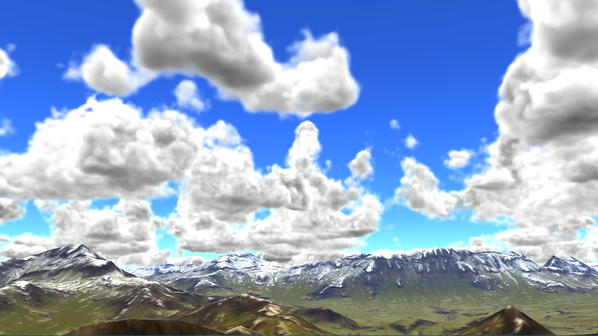](https://vimeo.com/344675521)

 For Ephemeris and the rest of our commercial custom middleware there is now a new GitHub repository here [Custom-Middleware](https://github.com/ConfettiFX/Custom-Middleware) 

 We also have a skydome system for mobile hardware called Ephemeris 1, that will be released on GitHub later.

 * Android: we are supporting now more and more unit tests in Android by improving the run-time support. Here are screenshots:

01_Transformations
 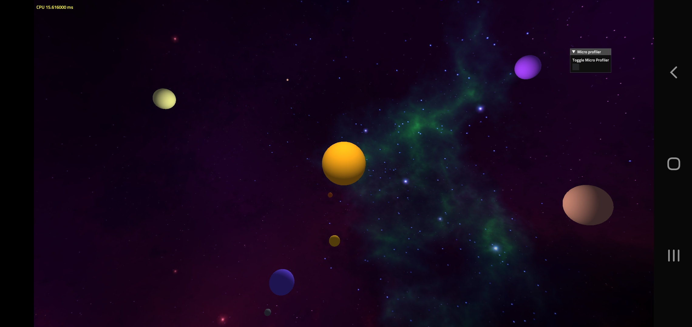

02_Compute
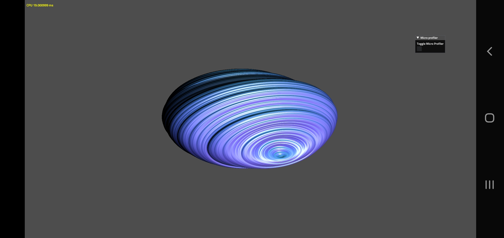

05_FontRendering
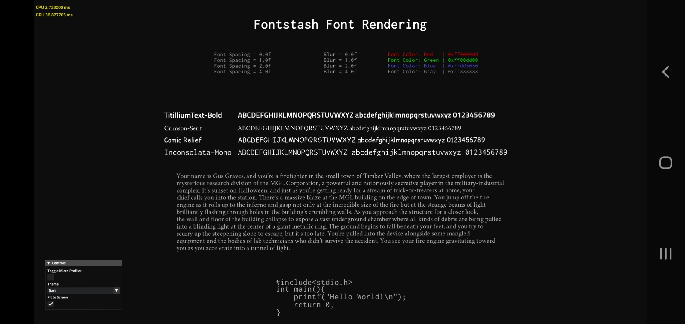

09_LightAndShadow


13_imGUI
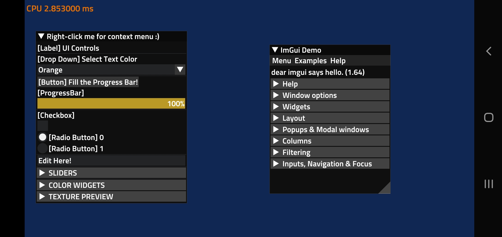

17_EntityComponentSystem
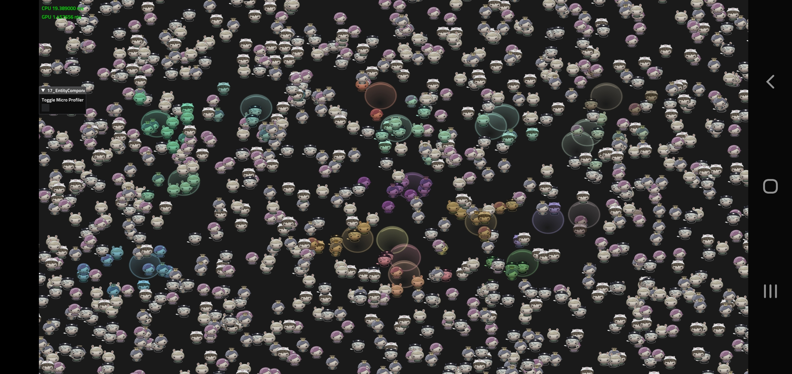

 We added the Samsung S10 Galaxy phone (Qualcomm Adreno 640 Graphics Card (Vulkan 1.1.87)) to the test devices for Android. 

 * ENTT: we decided to remove ENTT and replace it with our own ECS system that we use internally for tools. ENTT in debug is too slow for practical usage because it decreases execution speed and increases compile times substantially. It appears that "modern C++ 17" and probably also "modern C++ 14" is not ready for usage in a team environment because it decreases productivity too much. We tried to remove C++ 17 and 14 features to make it run faster but it ended up too much work. We went from more than 200 ms with ENTT to 60 ms with our own ECS running a Debug build on a Intel Core i7-6700T 2.8GHz. In release our own system is in the moment not as fast as ENTT but we will fix that.

 * Audio: we did a first pass on integrating [SoLoud](https://github.com/jarikomppa/soloud) for all our platforms. There is a new unit test:


 
 * Linux: following STEAM, we are switching to the Mesa RADV driver in our test environment for AMD GPUs. For NVIDIA GPUs we are still using the NVIDIA driver.

 * Texture Asset pipeline: we did a first pass on a unified texture asset pipeline. On the app level only the name of the texture needs to be provided and then depending on the underlying platform it will attempt to load the "optimal compressed" texture, which in the moment is either KTX or dds. In the future there will be Google Basis support as well.
   * Removed support for various non-optimal texture file formats - png, jpg, tga, hdr, exr
   * Add ASTC support for iOS through KTX container
   * Add compressed textures for all unit test resources
   * Add BC6H signed and unsigned float variants
   
  Please make sure you download the art asset zip file again with the help of the batch file.

* Issue list:
   * issue #109 "Texture updates broken" is fixed now
   * NVIDIA GTX 1660 bug: this card with the Vulkan run-time and driver 419.35 became unresponsive, while the DirectX 12 run-time works as expected. Any other NVIDIA GPU works fine ... this looks like a driver bug ...


See the release notes from previous releases in the [Release section](https://github.com/ConfettiFX/The-Forge/releases).

  
# PC Windows Requirements:

1. Windows 10 

2. Drivers
* AMD / NVIDIA / Intel - latest drivers 

3. Visual Studio 2017 with Windows SDK / DirectX version 17763.132 (you need to get it via the Visual Studio Intaller)
https://developer.microsoft.com/en-us/windows/downloads/sdk-archive

4. The Forge supports now as the min spec for the Vulkan SDK 1.1.82.0 and as the max spec is  [1.1.114](https://vulkan.lunarg.com/sdk/home)

6. The Forge is currently tested on 
* AMD 5x, VEGA GPUs (various)
* NVIDIA GeForce 9x, 10x. 20x GPUs (various)
* Intel Skull Canyon


# macOS Requirements:

1. macOS 10.15 Beta (19A487m)

2. Xcode 11.0 beta 2 (11M337n)

3. The Forge is currently tested on the following macOS devices:
* iMac with AMD RADEON 560 (Part No. MNDY2xx/A)
* iMac with AMD RADEON 580 (Part No. MNED2xx/A)
* MacBook Pro 13 inch (MacBookPro13,2) 
* Macbook Pro 13 inch (MacbookPro14,2)

In the moment we do not have access to an iMac Pro or Mac Pro. We can test those either with Team Viewer access or by getting them into the office and integrating them into our build system.
We will not test any Hackintosh configuration. 


# iOS Requirements:

1. iOS 13 beta 

2. XCode: see macOS

To run the unit tests, The Forge requires an iOS device with an A9 or higher CPU (see [GPU Processors](https://developer.apple.com/library/content/documentation/DeviceInformation/Reference/iOSDeviceCompatibility/HardwareGPUInformation/HardwareGPUInformation.html) or see iOS_Family in this table [iOS_GPUFamily3_v3](https://developer.apple.com/metal/Metal-Feature-Set-Tables.pdf)). This is required to support the hardware tessellation unit test and the ExecuteIndirect unit test (requires indirect buffer support). The Visibility Buffer doesn't run on current iOS devices because the [texture argument buffer](https://developer.apple.com/documentation/metal/fundamental_components/gpu_resources/understanding_argument_buffers) on those devices is limited to 31 (see [Metal Feature Set Table](https://developer.apple.com/metal/Metal-Feature-Set-Tables.pdf) and look for the entry "Maximum number of entries in the texture argument table, per graphics or compute function") , while on macOS it is 128, which we need for the bindless texture array. 

We are currently testing on 
* iPhone 7 (Model A1778)
* iPhone Xs Max (Model MT5D2LL/A)


# iPad OS Requirements:

1. iPad OS beta 2 

2. XCode: see macOS

We are currently testing on:
* iPad (Model A1893)


# PC Linux Requirements:

1. [Ubuntu 18.04 LTS](https://www.ubuntu.com/download/desktop) Kernel Version: 4.15.0-20-generic

2. GPU Drivers:
  * AMD GPUs: we are testing on the [Mesa RADV driver](https://launchpad.net/~paulo-miguel-dias/+archive/ubuntu/pkppa/)
  * NVIDIA GPUs: we are testing with the [NVIDIA driver](http://www.nvidia.com/object/unix.html)

3. Workspace file is provided for [codelite 12.0.6](https://codelite.org/)

4. Vulkan SDK Version 1.1.101: download the native Ubuntu Linux package for all the elements of the Vulkan SDK [LunarG Vulkan SDK Packages for Ubuntu 16.04 and 18.04](https://packages.lunarg.com/)


5. The Forge is currently tested on Ubuntu with the following GPUs:
 * AMD RADEON RX 480
 * AMD RADEON VEGA 56
 * NVIDIA GeForce 2070 RTX


# Android Requirements:

1. Android Phone with Android Pie (9.x) for Vulkan 1.1 support

2. Visual Studio 2017 with support for Android API level 28

At the moment, the Android run-time does not support the following unit tests due to -what we consider- driver bugs:
* 04_ExecuteIndirect
* 07_Tesselation 
* 08_Procedural
* 09a_HybridRayTracing
* 10_PixelProjectedReflections
* 12_RendererRuntimeSwitch
* 14_WaveIntrinsics
* 15_Transparency 
* 16_RayTracing 
* 16a_SphereTracing
* Visibility Buffer 

3. We are currently testing on 
* [Samsung S10 Galaxy (Qualcomm Adreno 640 Graphics Cardv(Vulkan 1.1.87))](https://www.samsung.com/us/mobile/galaxy-s10/) with Android 9.0. Please note this is the version with the Qualcomm based chipset.
* [Essential Phone](https://en.wikipedia.org/wiki/Essential_Phone) with Android 9.0 - Build PPR1.181005.034


# Install 
 * For PC Windows run PRE_BUILD.bat. It will download and unzip the art assets and install the shader builder extension for Visual Studio 2017.
 * For Linux and Mac run PRE_BUILD.command. If its the first time checking out the forge make sure the PRE_BUILD.command has the correct executable flag by running the following command
  chmod +x PRE_BUILD.command
  
    It will only download and unzip required Art Assets (No plugins/extensions install). 

# Unit Tests
There are the following unit tests in The Forge:

## 1. Transformation

This unit test just shows a simple solar system. It is our "3D game Hello World" setup for cross-platform rendering.


## 2. Compute

This unit test shows a Julia 4D fractal running in a compute shader. In the future this test will use several compute queues at once.


## 3. Multi-Threaded Rendering

This unit test shows how to generate a large number of command buffers on all platforms supported by The Forge. This unit test is based on [a demo by Intel called Stardust](https://software.intel.com/en-us/articles/using-vulkan-graphics-api-to-render-a-cloud-of-animated-particles-in-stardust-application).


## 4. ExecuteIndirect

This unit test shows the difference in speed between Instanced Rendering, using ExecuteIndirect with CPU update of the indirect argument buffers and using ExecuteIndirect with GPU update of the indirect argument buffers.
This unit test is based on [the Asteroids example by Intel](https://software.intel.com/en-us/articles/asteroids-and-directx-12-performance-and-power-savings).


Using ExecuteIndirect with GPU updates for the indirect argument buffers


Using ExecuteIndirect with CPU updates for the indirect argument buffers


Using Instanced Rendering

## 5. Font Rendering

This unit test shows the current state of our font rendering library that is based on several open-source libraries.


## 6. Material Playground

This unit test shows a range of game related materials:

Hair:
Many years ago in 2012 / 2013, we helped AMD and Crystal Dynamics with the development of TressFX for Tomb Raider. We also wrote an article about the implementation in GPU Pro 5 and gave a few joint presentations on conferences like FMX. At the end of last year we revisited TressFX. We took the current code in the GitHub repository, changed it a bit and ported it to The Forge. It now runs on PC with DirectX 12 / Vulkan, macOS and iOS with Metal 2 and on the XBOX One. We also created a few new hair assets so that we can showcase it. Here is a screenshot of our programmer art:


Metal:


Wood:


## 7. Hardware Tessellation

This unit test showcases the rendering of grass with the help of hardware tessellation.


## 8. Procedural 
In the spirit of the shadertoy examples this unit test shows a procedurally generated planet.


## 9. Light and Shadow Playground
This unit test shows various shadow and lighting techniques that can be chosen from a drop down menu. There will be more in the future.

 * Exponential Shadow Map - this is based on [Marco Salvi's](https://pixelstoomany.wordpress.com/category/shadows/exponential-shadow-maps/) @marcosalvi papers. This technique filters out the edge of the shadow map by approximating the shadow test using exponential function that involves three subjects: the depth value rendered by the light source, the actual depth value that is being tested against, and the constant value defined by the user to control the softness of the shadow
  * Adaptive Shadow Map with Parallax Correction Cache - this is based on the article "Parallax-Corrected Cached Shadow Maps" by Pavlo Turchyn in [GPU Zen 2](https://gpuzen.blogspot.com/2019/05/gpu-zen-2-parallax-corrected-cached.htm). It adaptively chooses which light source view to be used when rendering a shadow map based on a hiearchical grid structure. The grid structure is constantly updated depending on the user's point of view and it uses caching system that only renders uncovered part of the scene. The algorithm greatly reduce shadow aliasing that is normally found in traditional shadow map due to insufficient resolution. Pavlo Turchyn's paper from GPU Pro 2 added an additional improvement by implementing multi resolution filtering, a technique that approximates larger size PCF kernel using multiple mipmaps to achieve cheap soft shadow. He also describes how he integrated a Parallax Correction Cache to Adaptive Shadow Map, an algorithm that approximates moving sun's shadow on static scene without rendering tiles of shadow map every frame. The algorithm is generally used in an open world game to approximate the simulation of day & night’s shadow cycle more realistically without too much CPU/GPU cost.
  * Signed Distance Field Soft Shadow - this is based on [Daniel Wright's Siggraph 2015](http://advances.realtimerendering.com/s2015/DynamicOcclusionWithSignedDistanceFields.pdf) @EpicShaders presentation. To achieve real time SDF shadow, we store the distance to the nearest surface for every unique Meshes to a 3D volume texture atlas. The Mesh SDF is generated offline using triangle ray tracing, and half precision float 3D volume texture atlas is accurate enough to represent 3D meshes with SDF. The current implementation only supports rigid meshes and uniform transformations (non-uniform scale is not supported). An approximate cone intersection can be achieved  by measuring the closest distance of a passed ray to an occluder which gives us a cheap soft shadow when using SDF.

To achieve  high-performance, the playground runs on our signature rendering architecture called Triangle Visibility Buffer. The step that generates the SDF data also uses this architecture.

Click on the following screenshot to see a movie:

[](https://vimeo.com/352985038)

The following PC screenshots are taken on Windows 10 with a AMD RX550 GPU (driver 19.7.1) with a resolution of 1920x1080. 

Exponential Shadow Maps:


Adaptive Shadow Map with Parallax Correction Cache


Signed Distance Field Soft Shadow:


Signed Distance Field Soft Shadows - Debug Visualization


The following shots show Signed Distance Field Soft Shadows running on iMac with a AMD RADEON Pro 580


The following shots show Signed Distance Field Soft Shadows running on XBOX One:


Readme for Signed Distance Field Soft Shadow Maps:

To generate the SDF Mesh data you should select “Signed Distance Field” as the selected shadow type in the Light and Shadow Playground. There is a button called “Generate Missing SDF” and once its clicked, it shows a progress bar that represents the remaining SDF mesh objects utilized for SDF data generation. This process is multithreaded, so the user can still move around the scene while waiting for the SDF process to be finished. This is a long process and it could consume up to 8+ hours depending on your CPU specs. To check how many SDF objects there are presently in the scene, you can mark the checkbox "Visualize SDF Geometry On The Scene".

## 9a. Hybrid Ray-Traced Shadows
This unit test was build by Kostas Anagnostou @KostasAAA to show how to ray trace shadows without using a ray tracing API like DXR / RTX. It should run on all GPUs (not just NVIDIA RTX GPUs) and the expectation is that it should run comparable with a DXR / RTX based version even on a NVIDIA RTX GPU. That means the users of your game do not have to buy a NVIDIA RTX GPU to enjoy HRT shadows :-)


## 10. Pixel-Projected Reflections
This unit test shows reflections that are ray traced. It is an implementation of the papers [Optimized pixel-projected reflections for planar reflectors](http://advances.realtimerendering.com/s2017/PixelProjectedReflectionsAC_v_1.92.pdf) and [IMPLEMENTATION OF OPTIMIZED PIXEL-PROJECTED REFLECTIONS FOR PLANAR REFLECTORS](https://github.com/byumjin/Jin-Engine-2.1/blob/master/%5BByumjin%20Kim%5D%20Master%20Thesis_Final.pdf)


## 11. Multi-GPU (Driver support only on PC Windows)
This unit test shows a typical VR Multi-GPU configuration. One eye is rendered by one GPU and the other eye by the other one.


## 12. The Forge switching between Vulkan and DirectX 12 during Run-time (Windows PC-only)
This unit test shows how to switch between the Vulkan and DirectX 12 graphics API during run-time. 


## 13. imGUI integration unit test
This unit test shows how the integration of imGui with a wide range of functionality.


## 14. Order-Independent Transparency unit test
This unit test compares various Order-Indpendent Transparency Methods. In the moment it shows:
- Alpha blended transparency
- Weighted blended Order Independent Transparency [Morgan McGuire Blog Entry 2014](http://casual-effects.blogspot.com/2014/03/weighted-blended-order-independent.html) and [Morgan McGuire Blog Entry 2015](http://casual-effects.blogspot.com/2015/03/implemented-weighted-blended-order.html)
- Weighted blended Order Independent Transparency by Volition [GDC 2018 Talk](https://www.gdcvault.com/play/1025400/Rendering-Technology-in-Agents-of)
- Adaptive Order Independent Transparency with Raster Order Views [paper by Intel, supports DirectX 11, 12 only](https://software.intel.com/en-us/articles/oit-approximation-with-pixel-synchronization-update-2014), and a [Primer](https://software.intel.com/en-us/gamedev/articles/rasterizer-order-views-101-a-primer)
- Phenomenological Transparency - Diffusion, Refraction, Shadows by [Morgan McGuire](https://casual-effects.com/research/McGuire2017Transparency/McGuire2017Transparency.pdf)
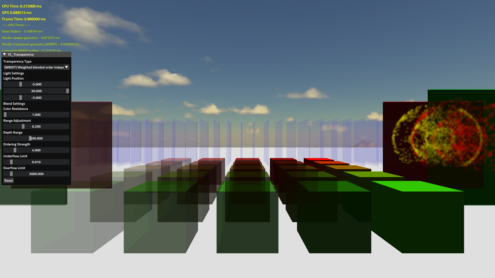


## 15. Wave Intrinsics unit test
This unit test shows how to use the new wave intrinsics. Supporting Windows with DirectX 12 / Vulkan, Linux with Vulkan and macOS / iOS.

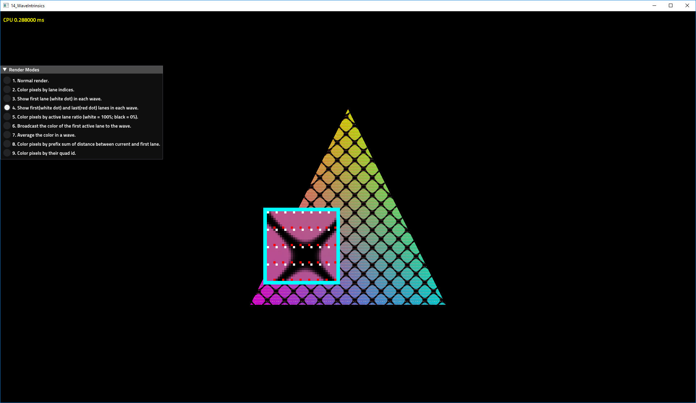

## 16. Ray Tracing Unit Test
Ray Tracing API unit test, showing how the cross-platfrom Ray Tracing Interface running on Windows, Ubuntu with Vulkan RTX, macOS and iOS

PC Windows 10 RS5, DirectX12, GeForce RTX 2070, Driver version 418.81 1080p:


PC Ubuntu Vulkan RTX, GeForce RTX 2070, Driver Version 418.56 1080p


Mac Mini with Intel Core i5 3GHz cpu with integrated graphics Intel UHD Graphics 630 (Part No. MRTT2RU/A) with resolution 3440x1440:
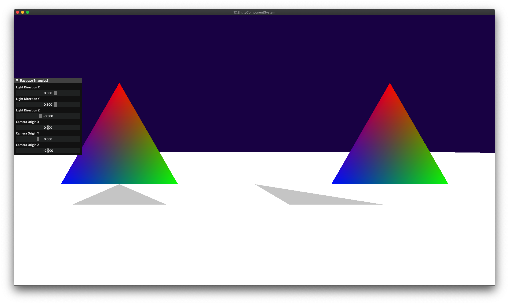

iPad 6th Generation iOS 12.1.3 (16D39) with a resolution of 2048x1536


## 16a. Sphere Tracing
This unit test was originally posted on ShaderToy by [Inigo Quilez](https://www.shadertoy.com/view/Xds3zN) and [Sopyer](https://sopyer.github.io/b/post/vulkan-shader-sample/). It shows how a scene is ray marched with shadows, reflections and AO

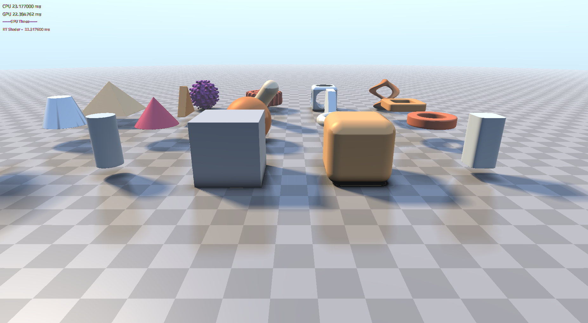

## 17. Entity Component System Test
This unit test shows how to use the high-performance entity component system in The Forge. This unit test is based on a ECS system that we developed internally for tools.


## 18. Ozz Playback Animation
This unit test shows how to playback a clip on a rig.


## 19. Ozz Playback Blending
This unit test shows how to blend multiple clips and play them back on a rig.


## 20. Ozz Joint Attachment
This unit test shows how to attach an object to a rig which is being posed by an animation.

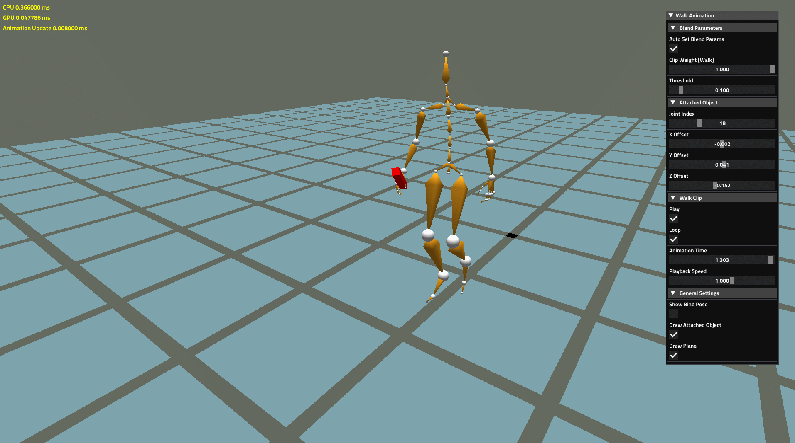

## 21. Ozz Partial Blending
This unit test shows how to blend clips having each only effect a certain portion of joints.

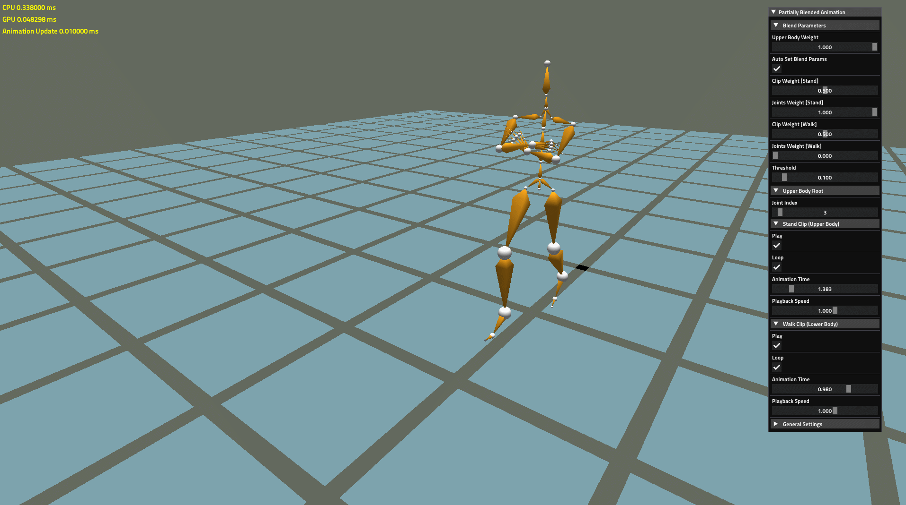

## 22. Ozz Additive Blending
This unit test shows how to introduce an additive clip onto another clip and play the result on a rig.

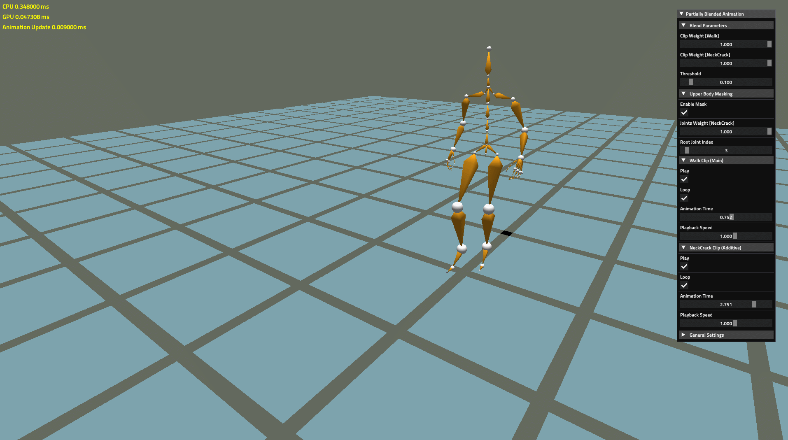

## 23. Ozz Baked Physics
This unit test shows how to use a scene of a physics interaction that has been baked into an animation and play it back on a rig.


## 24. Ozz Multi Threading
This unit test shows how to animate multiple rigs simultaneously while using multi-threading for the animation updates.


## 25. Ozz Skinning
This unit test shows how to use skinning with Ozz


## 26. Audio Integration of SoLoud
We integrated SoLoad. Here is a unit test that allow's you make noise ...


# Examples
There is an example implementation of the Triangle Visibility Buffer as covered in various conference talks. [Here](https://diaryofagraphicsprogrammer.blogspot.com/2018/03/triangle-visibility-buffer.html) is a blog entry that details the implementation in The Forge.


# Tools
Below are screenshots and descriptions of some of the tools we integrated.

## Microprofiler
We integrated the [Micro Profiler](https://github.com/zeux/microprofile) into our code base. 

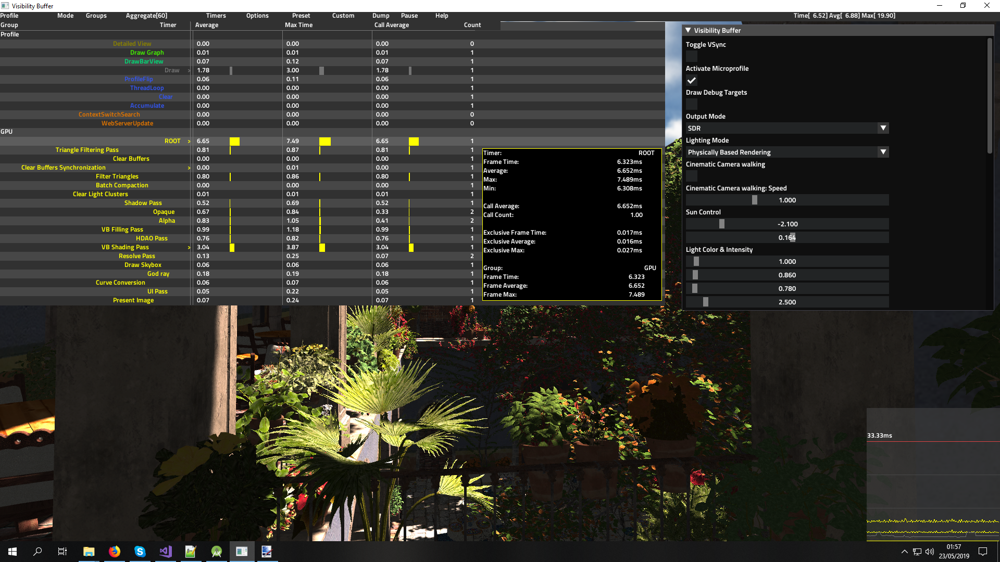

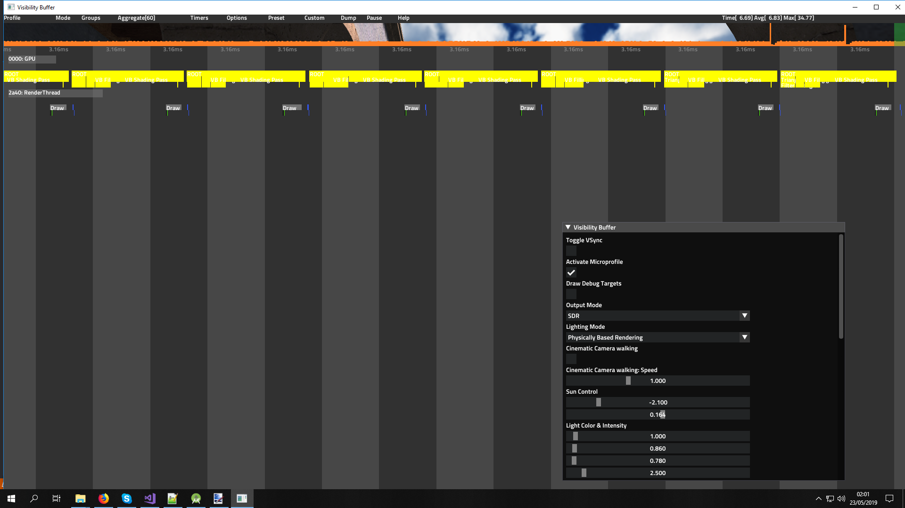

To enable/disable profiling, go to file ProfileEnableMacro.h line 9 and set it
to 0(disabled) or 1(enabled). 
It's supported on the following platforms:
 - Windows
 - Linux
 - macOS (GPU profiling is disabled)
 - iOS (GPU profiling is disabled)
 - Android 

MicroProfile provides us an easy to use UI and visualization our frame.

How to use it:
MicroProfile has different display modes. The most useful one when running inside
the application is Timers. We can change the display mode going to Mode and right
clicking the one we want.

If we are on Timer, we will be able to right click on the labels. This will enable
a graph at the bottom left.

If we wanted to just see some of the groups inside the profile display, go to Groups
and select the ones you want.

The other options are self explanatory.

If the user wants to dump the profile to a file, we just need to go to dump,
and right click on the amount of frames we want. This generates a html file in the
executable folder. Open it with your prefered web browser to have a look.

Dumping is useful, because we will be able to see the profile frame by frame,
without it being updated every frame. This will be useful when displaying in Detailed
mode.

For any doubt on the use of the MicroProfile, hover Help.


# Releases / Maintenance
Confetti will prepare releases when all the platforms are stable and running and push them to this GitHub repository. Up until a release, development will happen on internal servers. This is to sync up the console, mobile, macOS and PC versions of the source code.

# Products
We would appreciate it if you could send us a link in case your product uses The Forge. Here are the ones we received so far:

## StarVR One SDK
The Forge is used to build the StarVR One SDK:

<a href="https://www.starvr.com" target="_blank"></a>

## Torque 3D
The Forge is used as the rendering framework in Torque 3D:

<a href="http://www.garagegames.com/products/torque-3d" target="_blank"></a>

## Star Wars Galaxies Level Editor
SWB is an editor for the 2003 game 'Star Wars Galaxies' that can edit terrains, scenes, particles and import/export models via FBX. The editor uses an engine called 'atlas' that will be made open source in the future. It focuses on making efficient use of the new graphics APIs (with help from The-Forge!), ease-of-use and terrain rendering.


# Writing Guidelines
For contributions to The Forge we apply the following writing guidelines:
 * We limit all code to C++ 11 by setting the Clang and other compiler flags
 * We follow the [Orthodox C++ guidelines] (https://gist.github.com/bkaradzic/2e39896bc7d8c34e042b) minus C++ 14 support (see above)

# User Group Meetings 
There will be a user group meeting during GDC. In case you want to organize a user group meeting in your country / town at any other point in time, we would like to support this. We could send an engineer for a talk.

# Support for Education 
In case your School / College / University uses The Forge for education, we would like to support this as well. We could send an engineer or help create material. So far the following schools use The Forge for teaching:

[Breda University of Applied Sciences](https://www.buas.nl) 
```
        Contact:
        Jeremiah van Oosten 
        Monseigneur Hopmansstraat 1
        4817 JT Breda
 ```
[Ontario Tech University](https://uoit.ca/) 
```
        Contact:
        Andrew Hogue
        Ontario Tech University
        SIRC 4th floor
        2000 Simcoe St N
        Oshawa, ON, L1H 7K4
 ```


# Open-Source Libraries
The Forge utilizes the following Open-Source libraries:
* [Assimp](https://github.com/assimp/assimp)
* [Bullet Physics](https://github.com/bulletphysics)
* [Fontstash](https://github.com/memononen/fontstash)
* [Vectormath](https://github.com/glampert/vectormath)
* [Nothings](https://github.com/nothings/stb) single file libs 
  * [stb.h](https://github.com/nothings/stb/blob/master/stb.h)
  * [stb_image.h](https://github.com/nothings/stb/blob/master/stb_image.h)
  * [stb_image_resize.h](https://github.com/nothings/stb/blob/master/stb_image_resize.h)
  * [stb_image_write.h](https://github.com/nothings/stb/blob/master/stb_image_write.h)
* [shaderc](https://github.com/google/shaderc)
* [SPIRV_Cross](https://github.com/KhronosGroup/SPIRV-Cross)
* [TinyEXR](https://github.com/syoyo/tinyexr)
* [Vulkan Memory Allocator](https://github.com/GPUOpen-LibrariesAndSDKs/VulkanMemoryAllocator)
* [GeometryFX](https://gpuopen.com/gaming-product/geometryfx/)
* [WinPixEventRuntime](https://blogs.msdn.microsoft.com/pix/winpixeventruntime/)
* [Fluid Studios Memory Manager](http://www.paulnettle.com/)
* [volk Metaloader for Vulkan](https://github.com/zeux/volk)
* [gainput](https://github.com/jkuhlmann/gainput)
* [hlslparser](https://github.com/Thekla/hlslparser)
* [imGui](https://github.com/ocornut/imgui)
* [DirectX Shader Compiler](https://github.com/Microsoft/DirectXShaderCompiler)
* [Ozz Animation System](https://github.com/guillaumeblanc/ozz-animation)
* [Lua Scripting System](https://www.lua.org/)
* [TressFX](https://github.com/GPUOpen-Effects/TressFX)
* [Micro Profiler](https://github.com/zeux/microprofile)
* [MTuner](https://github.com/milostosic/MTuner) 
* [EASTL](https://github.com/electronicarts/EASTL/)
* [enkiTS](https://github.com/dougbinks/enkiTS)
* [SoLoud](https://github.com/jarikomppa/soloud)

