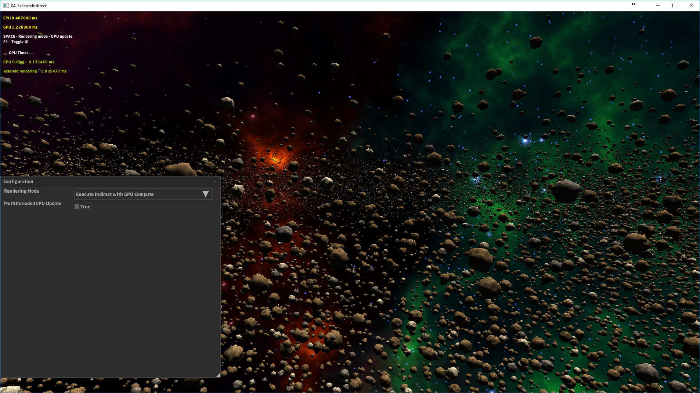
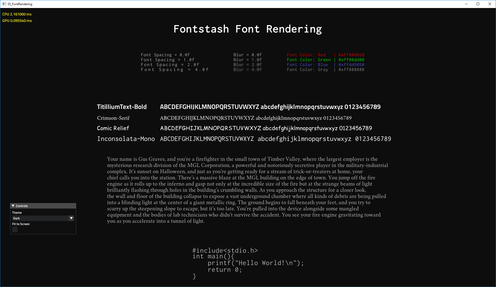
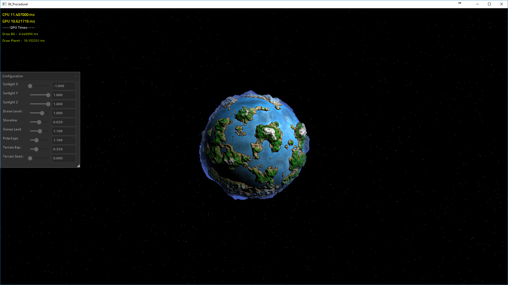
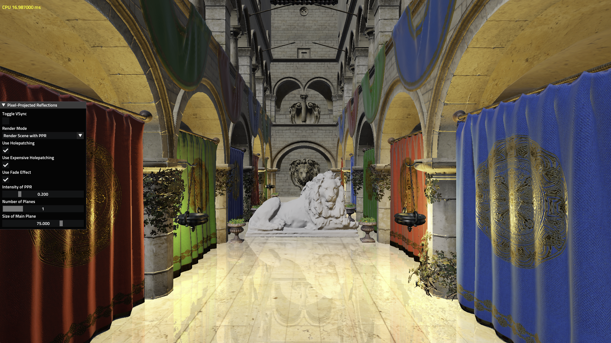

# 

The Forge is a cross-platform rendering framework supporting
- PC 
  * Windows 10 
     * with DirectX 12 / Vulkan
     * with DirectX Ray Tracing API
  * Linux Ubuntu 18.04 LTS with Vulkan
- macOS with Metal 2
- iOS with Metal 2
- Android with Vulkan (in development)
- XBOX One / XBOX One X (only available for accredited developers on request)
- PS4 (in development) (only available for accredited developers on request)

Particularly, The Forge supports cross-platform
- Descriptor management
- Multi-threaded resource loading
- Shader reflection
- Multi-threaded command buffer generation

Future plans are:
- Unified shader generation

The intended usage of The Forge is to enable developers to quickly build their own game engines. The Forge can provide the rendering layer for custom next-gen game engines. 

<a href="https://twitter.com/TheForge_FX?lang=en" target="_blank"> Join the channel at https://twitter.com/TheForge_FX?lang=en</a>
 
# Build Status 

* Windows 
* macOS 

# News

## Release 1.13 - July 13th, 2018 - Unified Input System for all Platforms | New unit Test Light and Shadow Playground
* Added a unified input system based on Gainput to all platforms (https://github.com/jkuhlmann/gainput). The new input system substantially simplified input management on the application level over all platforms. We also simplified the camera controller. Added also new VirtualJoystick class in UI.
* Added a Light and Shadow Playground unit test. There are two types of shadows supported in the moment exponential shadows and SDF shadows. There is a switch to pick one of them during run-time. In the future there will be more complex lighting and shadow setups.

* There is now functionality to create views per mip / per slice for textures and render target through TextureUsage and RenderTargetUsage flags (typecast cube map to 2D texture array etc.)
* UIRenderer was removed and there is now a dedicated text rendering system different from UI rendering and no UI rendering interface anymore
* cmdbindVertexBuffer, cmdBindIndexBuffer now support offsets
* cmdBindRenderTargets now takes color array, mip slices, depth array and mip slice index
* The Pixel-Projected Reflections unit test now uses bindless textures on all platforms except for iOS as its too many to bind in one go.
* iOS: all unit tests run on our iOS test device; Visibility Buffer still doesn't as described below. 
* Moved the release notes from this page into the release section and added actual releases

## Release 1.12 - June 21st, 2018 - Support of Typed Buffers | New unit test Pixel-Projected Reflections | Updated Material Playground unit test
* New unit test Pixel-Projected Reflections: this unit test shows reflections that are ray traced. It is an implementation of the papers [Optimized pixel-projected reflections for planar reflectors](http://advances.realtimerendering.com/s2017/PixelProjectedReflectionsAC_v_1.92.pdf) and [Implementation of Optimized Pixel-Projected Reflections for Planar Reflections](https://github.com/byumjin/Jin-Engine-2.1/blob/master/%5BByumjin%20Kim%5D%20Master%20Thesis_Final.pdf)
Sponza was added to the Art folder for this unit test.
* Updated unit test Material Playground: started out with Materials that can be summed up in the category Metal. Ironically this unit test currently doesn't run on iOS due to textures that are too large ... we fix this in the next release.
* Extended the GPU config system further by adding more GPUs and classifying them with also better support for the GPU Workbench
* DirectX 12 / Vulkan: 
  * added support for passing offsets, sizes through arrays in DescriptorData
  * added typed buffer support
  * upgraded to the 1.1.77.0 Vulkan SDK and updated volk for this
* macOS: V-Sync is now switchable
* Added 3D ability to the text rendering library: it was used to render the labels in the Material Playground unit test
* Resolved issues (zeros issues now? ... please keep them coming!):
  * #23 Request: Support V-Sync off on Metal unit tests..
  * #56 getUSec function in WindowsBase.cpp seem buggy

See the release notes from previous releases in the [Release section](https://github.com/ConfettiFX/The-Forge/releases).

  
# PC Windows Requirements:

1. Windows 10 with latest update

2. Drivers
* AMD / NVIDIA - latest drivers should work. On Vulkan, at least NVIDIA Beta Driver 389.20 are required to support Linked Multi-GPU. 
* Intel - need to install the latest driver (currently 24.20.100.6094, May 22nd) [Intel® Graphics Driver for Windows® 10](https://downloadcenter.intel.com/download/27803/Intel-Graphics-Driver-for-Windows-10). As mentioned above this driver still doesn't have full DirectX 12 and Vulkan support.

3. Visual Studio 2017 with Windows SDK / DirectX version 16299.91 (Fall Creators Update)
https://developer.microsoft.com/en-us/windows/downloads/sdk-archive

4. Vulkan SDK 1.1.77.0
https://vulkan.lunarg.com/

5. Ray Tracing 
 * DirectX Raytracing Experimental SDK v0.09.01
 * Windows 10 RS4 builds more info at [DXR](http://aka.ms/DXR)

6. The Forge is currently tested on 
* AMD 5x, VEGA GPUs (various)
* NVIDIA GeForce 9x, 10x GPUs (various)
* Intel Skull Canyon

# macOS Requirements:

1. macOS: 10.14 Beta (18A293u)

2. XCode: 10.0 beta (10L176w) 

3. The Forge is currently tested on the following macOS devices:
* iMac with AMD RADEON 560 (Part No. MNDY2xx/A)
* iMac with AMD RADEON 580 (Part No. MNED2xx/A)
* MacBook Pro 13 inch (MacBookPro13,2) 
* Macbook Pro 13 inch (MacbookPro14,2)

In the moment we do not have access to an iMac Pro or Mac Pro. We can test those either with Team Viewer access or by getting them into the office and integrating them into our build system.
We will not test any Hackintosh configuration. 

# iOS Requirements:

1. iOS: 11.4 (15F79) 

2. XCode: see macOS

To run the unit tests, The Forge requires an iOS device with an A9 or higher CPU (see [GPU Processors](https://developer.apple.com/library/content/documentation/DeviceInformation/Reference/iOSDeviceCompatibility/HardwareGPUInformation/HardwareGPUInformation.html) or see iOS_Family in this table [iOS_GPUFamily3_v3](https://developer.apple.com/metal/Metal-Feature-Set-Tables.pdf)). This is required to support the hardware tessellation unit test and the ExecuteIndirect unit test (requires indirect buffer support). The Visibility Buffer doesn't run on current iOS devices because the [texture argument buffer](https://developer.apple.com/documentation/metal/fundamental_components/gpu_resources/understanding_argument_buffers) on those devices is limited to 31 (see [Metal Feature Set Table](https://developer.apple.com/metal/Metal-Feature-Set-Tables.pdf) and look for the entry "Maximum number of entries in the texture argument table, per graphics or compute function") , while on macOS it is 128, which we need for the bindless texture array. 

We are currently testing on 
* iPhone 7 (Model A1778)

# PC Linux Requirements:

1. [Ubuntu 18.04 LTS](https://www.ubuntu.com/download/desktop) Kernel Version: 4.15.0-20-generic

2. GPU Drivers:
* [AMDGpu-Pro 18.20 Early Preview](https://support.amd.com/en-us/kb-articles/Pages/Radeon-Software-for-Linux-18.20-Early-Preview-Release-Notes.aspx)
* [NVIDIA Linux x86_64/AMD64/EM64T 390.59 and 396.24](http://www.nvidia.com/object/unix.html)

3. Workspace file is provided for [codelite](https://codelite.org/)

4. Vulkan SDK Version: [1.1.77.0](https://vulkan.lunarg.com/sdk/home)

5. The Forge is currently tested on Ubuntu with the following GPUs:
 * AMD RADEON RX 480
 * AMD RADEON VEGA 56
 * NVIDIA GeForce GTX 950

Make sure VulkanSDK environment variables are configured correctly.
Please read the "Set up the Runtime Environment" and "Environment Variable Persistence" [https://vulkan.lunarg.com/doc/sdk/1.1.70.1/linux/getting_started.html](https://vulkan.lunarg.com/doc/sdk/1.1.70.1/linux/getting_started.html)

# Install 
For PC Windows run PRE_BUILD.bat. For the other platforms run the shell script. It will download and unzip the art assets and only on PC install the shader builder extension for Visual Studio.

# Unit Tests
There are the following unit tests in The Forge:

## 1. Transformation

This unit test just shows a simple solar system. It is our "3D game Hello World" setup for cross-platform rendering.

## 2. Compute

This unit test shows a Julia 4D fractal running in a compute shader. In the future this test will use several compute queues at once.

## 3. Multi-Threaded Rendering

This unit test shows how to generate a large number of command buffers on all platforms supported by The Forge. This unit test is based on [a demo by Intel called Stardust](https://software.intel.com/en-us/articles/using-vulkan-graphics-api-to-render-a-cloud-of-animated-particles-in-stardust-application).

## 4. ExecuteIndirect

This unit test shows the difference in speed between Instanced Rendering, using ExecuteIndirect with CPU update of the indirect argument buffers and using ExecuteIndirect with GPU update of the indirect argument buffers.
This unit test is based on [the Asteroids example by Intel](https://software.intel.com/en-us/articles/asteroids-and-directx-12-performance-and-power-savings).

Using ExecuteIndirect with GPU updates for the indirect argument buffers

Using ExecuteIndirect with CPU updates for the indirect argument buffers

Using Instanced Rendering

## 5. Font Rendering

This unit test shows the current state of our font rendering library that is based on several open-source libraries.

## 6. Material Playground

This unit test will show a wide range of game related materials in the future.

## 7. Hardware Tessellation

This unit test showcases the rendering of grass with the help of hardware tessellation.

## 8. Procedural 
In the spirit of the shadertoy examples this unit test shows a procedurally generated planet.

## 9. Light and Shadow Playground
This unit test shows various shadow and lighting techniques that can be chosen from a drop down menu. There will be more in the future.

## 10. Pixel-Projected Reflections
This unit test shows reflections that are ray traced. It is an implementation of the papers [Optimized pixel-projected reflections for planar reflectors](http://advances.realtimerendering.com/s2017/PixelProjectedReflectionsAC_v_1.92.pdf) and [IMPLEMENTATION OF OPTIMIZED PIXEL-PROJECTED REFLECTIONS FOR PLANAR REFLECTORS](https://github.com/byumjin/Jin-Engine-2.1/blob/master/%5BByumjin%20Kim%5D%20Master%20Thesis_Final.pdf)

## 11. Multi-GPU (Driver support only on PC Windows)
This unit test shows a typical VR Multi-GPU configuration. One eye is rendered by one GPU and the other eye by the other one.

## 12. The Forge switching between Vulkan and DirectX 12 during Run-time (Windows PC-only)
This unit test shows how to switch between the Vulkan and DirectX 12 graphics API during run-time. 

# Examples
There is an example implementation of the Triangle Visibility Buffer as covered in various conference talks. [Here](https://diaryofagraphicsprogrammer.blogspot.com/2018/03/triangle-visibility-buffer.html) is a blog entry that details the implementation in The Forge.

# Releases / Maintenance
Confetti will prepare releases when all the platforms are stable and running and push them to this GitHub repository. Up until a release, development will happen on internal servers. This is to sync up the console, mobile, macOS and PC versions of the source code.

# Products
We would appreciate it if you could send us a link in case your product uses The Forge:

# Open-Source Libraries
The Forge utilizes the following Open-Source libraries:
* [Assimp](https://github.com/assimp/assimp)
* [Bullet Physics](https://github.com/bulletphysics)
* [Fontstash](https://github.com/memononen/fontstash)
* [Vectormath](https://github.com/glampert/vectormath)
* [Nothings](https://github.com/nothings/stb) single file libs 
  * [stb.h](https://github.com/nothings/stb/blob/master/stb.h)
  * [stb_image.h](https://github.com/nothings/stb/blob/master/stb_image.h)
  * [stb_image_resize.h](https://github.com/nothings/stb/blob/master/stb_image_resize.h)
  * [stb_image_write.h](https://github.com/nothings/stb/blob/master/stb_image_write.h)
* [Nuklear UI](https://github.com/vurtun/nuklear)
* [shaderc](https://github.com/google/shaderc)
* [SPIRV_Cross](https://github.com/KhronosGroup/SPIRV-Cross)
* [Task Scheduler](https://github.com/SergeyMakeev/TaskScheduler)
* [TinyEXR](https://github.com/syoyo/tinyexr)
* [TinySTL](https://github.com/mendsley/tinystl)
* [Vulkan Memory Allocator](https://github.com/GPUOpen-LibrariesAndSDKs/VulkanMemoryAllocator)
* [GeometryFX](https://gpuopen.com/gaming-product/geometryfx/)
* [WinPixEventRuntime](https://blogs.msdn.microsoft.com/pix/winpixeventruntime/)
* [Fluid Studios Memory Manager](http://www.paulnettle.com/)
* [volk Metaloader for Vulkan](https://github.com/zeux/volk)
