# 

The Forge is a cross-platform rendering framework supporting
- PC 
  * Windows 10 
     * with DirectX 12 / Vulkan 1.1
     * with DirectX Ray Tracing API
     * DirectX 11 Fallback Layer for Windows 7 support (not extensively tested)
  * Linux Ubuntu 18.04 LTS with Vulkan 1.1
- Android Pie with Vulkan 1.1
- macOS with Metal 2
- iOS with Metal 2
- XBOX One / XBOX One X (only available for accredited developers on request)
- PS4 (in development) (only available for accredited developers on request)

Particularly, The Forge supports cross-platform
- Descriptor management
- Multi-threaded resource loading
- Shader reflection
- Multi-threaded command buffer generation

Future plans are
- Unified shader generation -> check out an alpha version of the [Confetti Shader Translator](http://confettishadertranslator.azurewebsites.net)

The intended usage of The Forge is to enable developers to quickly build their own game engines. The Forge can provide the rendering layer for custom next-gen game engines. 

<a href="https://twitter.com/TheForge_FX?lang=en" target="_blank"> Join the channel at https://twitter.com/TheForge_FX?lang=en</a>
 
# Build Status 

* Windows 
* macOS 

# News

## Release 1.17 - October 4th, 2018 - Android Pie & Vulkan 1.1 Support  | iOS imGUI touch & virtual keyboard | DXR Ray Tracing support | Call for contributors to change IRenderer.h
* The Forge now has initial support for Android with the same Vulkan 1.1 run-time that is used by the Windows and Linux platforms. 

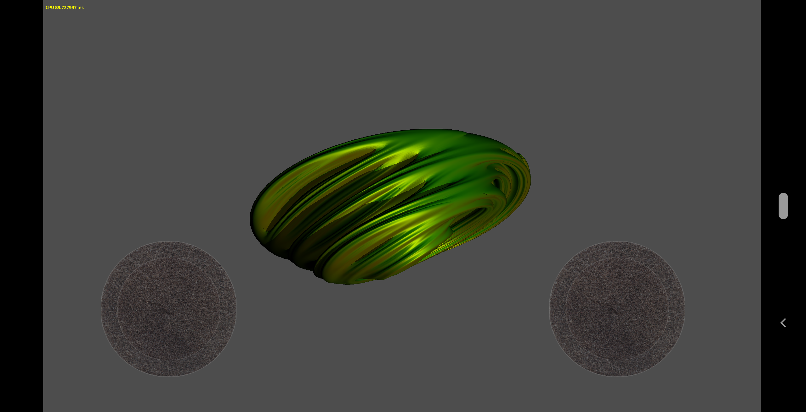

There are only a few phones that support Vulkan 1.1. We developed and support the 
[Essential Phone](https://en.wikipedia.org/wiki/Essential_Phone).
This phone uses an Adreno 540 GPU and can be obtained relatively cheap and unlocked from Amazon or similar sources. Please check out [Vulkan Gpuinfo.org](http://vulkan.gpuinfo.org/) for the supported feature list of this GPU with Android 9.0.
At the moment only the first two unit tests are running but we will extend the support to as many as we can in an upcoming release. We expect to run into driver bugs. We will not actively support Vulkan 1.0.
* Vulkan - mobile phone support see above
* iOS: 
  * upgraded to 12.0 (16A366)
  * we extended imGUI support for iOS with touch support and virtual keyboard
* Windows - fixed resizing ... should now work again with Alt+Enter ...
* Windows DXR - The Forge was the first rendering framework to support DXR, now that there will be hardware support, we added a screenshot of one of the unit tests below. We will add support for the other Ray Tracing APIs as well. They are useful for devloping Tools. For games we recommend the Hybrid Ray-Traced solutions provided below (so far only shadows).

* Upgraded the Order-Independent Transparency unit test to support Phenomenological Transparency as described in one of Morgan McGuire's papers. Here are screenshots:

Phenomenological Transparency - Refraction

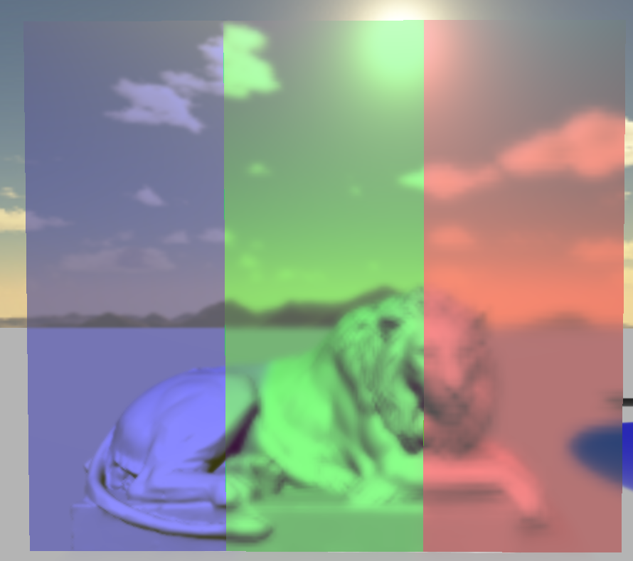

Phenomenological Transparency - Diffusion

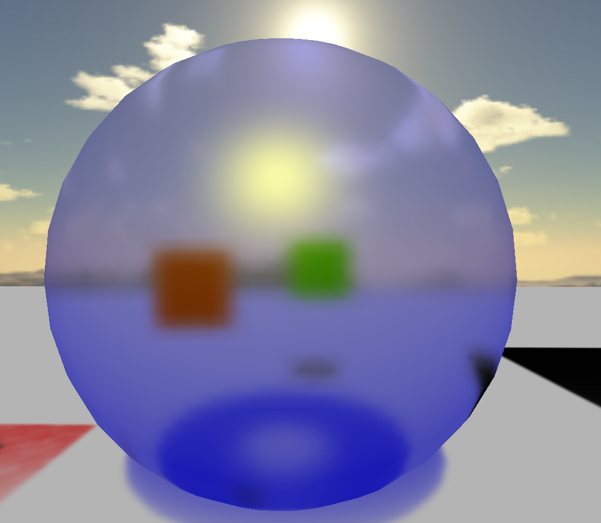

Phenomenological Transparency - Diffusion, Refraction, Shadows

* Linux - the wave intrinsics unit test now also works on Linux. We are looking into macOS / iOS next.
* Call for contributors to change IRenderer.h - as a heads-up, we will change the renderer interface to use our own way of "Render Passes and Compute Passes" similar to the Vulkan render passes. We will analyze render and compute calls and use this information to expose data to a "Render Graph" that will be implemented on a higher level. If you want to be part of the group that thinks about how we should adjust IRenderer.h for this, please send Wolfgang a note and your skype ID

## Release 1.16 - September 21st, 2018 - Order-Independent Transparency Unit Test | Wave Intrinsics Unit Test | Updated Confetti Shader Translator
* There is a new unit test that evaluates various Order-Independent Transparency methods:
  * Alpha blended transparency
  * Weighted blended Order Independent Transparency (Morgan McGuire)
  * Weighted blended Order Independent Transparency by Volition (GDC 2018 Talk)
  * Adaptive Order Independent Transparency with Raster Order Views (paper by Intel, supports DirectX 11, 12 only)
  There are more details and a comparison in the documentation folder of the unit test.

PC Windows 10 DirectX 12 GeForce 950 Driver 411.63 with a resolution of 1080p in full-screen:

Linux Vulkan 1.1.82.1 GeForce 1080 Driver 390.87 with a resolution of 1080p in full-screen:
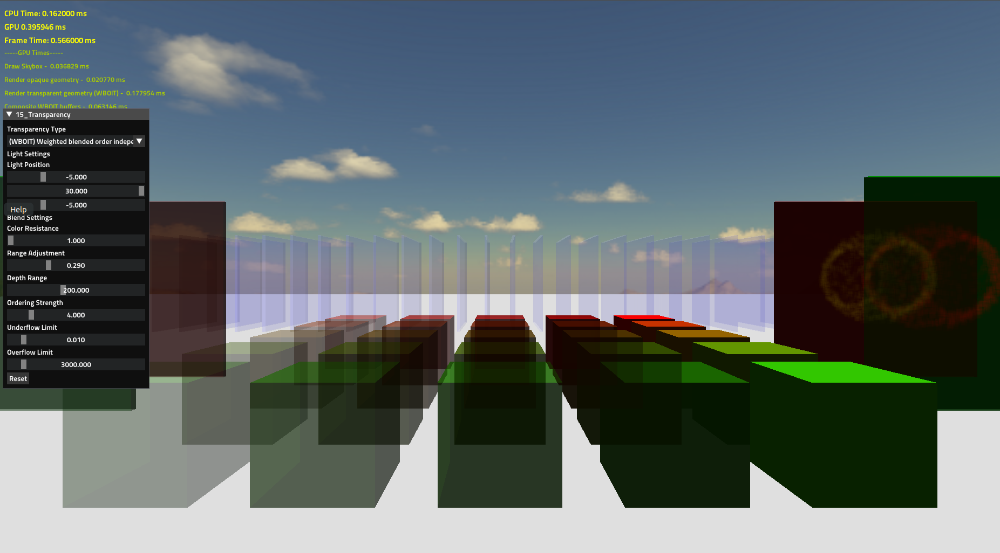

MacBook Pro (Model A1706) with a resolution of 1080p in full-screen:
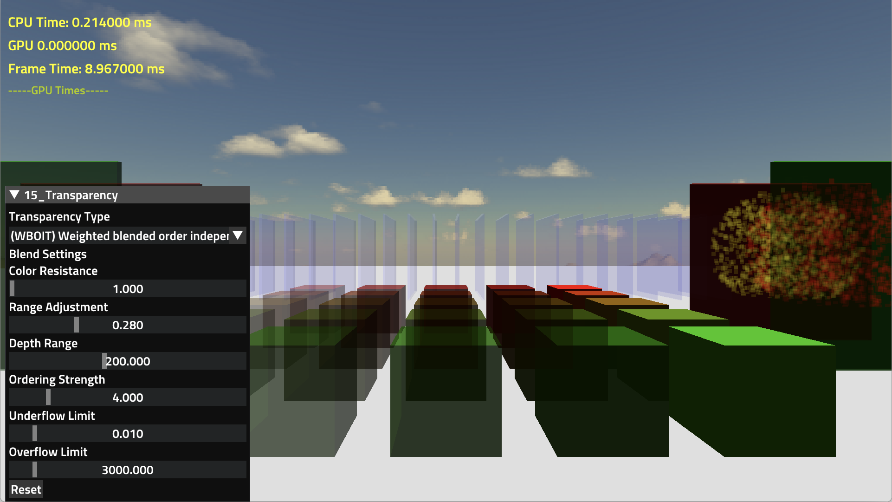

iPhone 7  with a resolution of 1334x750 in full-screen:
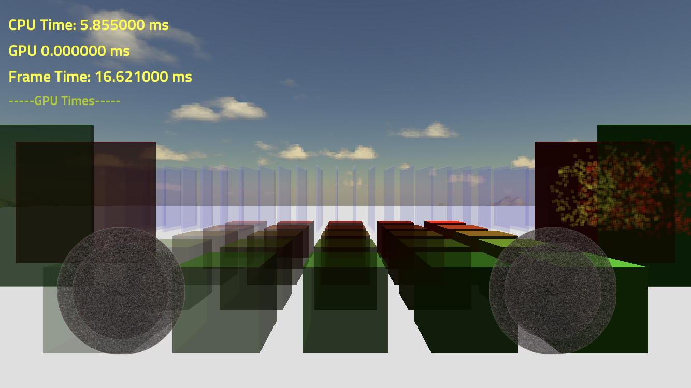

* There is a new Wave Intrinsics Unit test. It tests the new wave intrinsic instructions and makes sure they are support on PC Windows (DirectX 12 / Vulkan) for now. We are planning to add support on other platforms. On PC with DirectX it utilizes a "preview" integration of the DirectX Shader compiler. We were running into multiple bugs with DXC and decided to only use it for the new Shader model 6 shaders. So The Forge uses DXC for shaders that request shader_target_6_0 and FXC for everything below. The shader target can be specified during load time.

PC Windows 10 DirectX 12 GeForce 950 Driver 411.63 with a resolution of 1080p in full-screen:

* Vulkan
 * upgraded to the latest Vulkan Memory Allocator
 * Enabled subgroup extensions for Wave Intrinsics Unit Test
* macOS / iOS 
  * on-going work on improving input on macOS and iOS with imGUI
  * upgraded to macOS: 10.14 (18A389), XCode: 10 (10A254a)
* imGUI: improved implementation to make it a native citizen and expose the whole functionality. for tools, now there is more flexibility to create individual UIs for all apps. Check out the new screenshot below.

imGUI support:

* Linux - upgraded AMDGPU-Pro driver to 18.30-641594
* The Confetti Shader Translator received lots of bugs fixes and upgrades over the last six weeks. Head over to the URL and check it out. We have a large backlog with bugs and therefore it is still in alpha. New Features are:
  * include file support
  * preprocessor branching
  * switch statement
  * nested array
  * texture argments for functions
  * pur buffer (Buffer) type
  * Shader Model 6.0 (Wave)
    * SampleGrad()
    * GatherRed()   
    * all()
    * gatherRed()
    * f32to16()
    * f16to32()
    * NonUniformResourceIndex()
    * determinate functions 
  * GLSL
    * Shader Model 6.0 functions (Subgroup)
    * #extension system (Now, only necessary extensions are written, automatically)  
    * textureGather()
    * textureGrad()
  * added loading progress bar
  * and others ... 
  Here is a screenshot of the latest version.
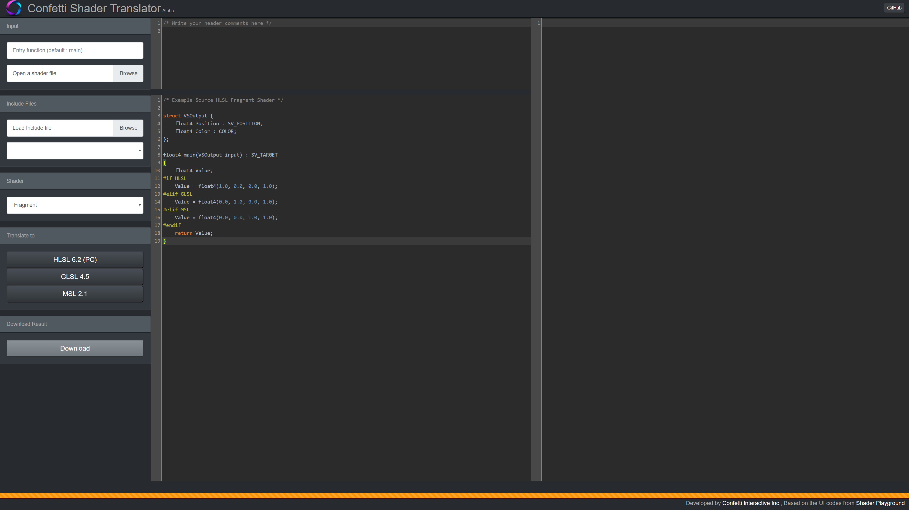

See the release notes from previous releases in the [Release section](https://github.com/ConfettiFX/The-Forge/releases).

  
# PC Windows Requirements:

1. Windows 10 with latest update

2. Drivers
* AMD / NVIDIA - latest drivers should work. On Vulkan, at least NVIDIA Beta Driver 389.20 are required to support Linked Multi-GPU. 
* Intel - need to install the latest driver (currently 24.20.100.6094, May 22nd) [Intel® Graphics Driver for Windows® 10](https://downloadcenter.intel.com/download/27803/Intel-Graphics-Driver-for-Windows-10). As mentioned before this driver still doesn't have full DirectX 12 and Vulkan support.

3. Visual Studio 2017 with Windows SDK / DirectX version 16299.91 (Fall Creators Update)
https://developer.microsoft.com/en-us/windows/downloads/sdk-archive

4. Vulkan [1.1.82.1](https://vulkan.lunarg.com/sdk/home)

5. Ray Tracing 
 * DirectX Raytracing Experimental SDK v0.09.01
 * Windows 10 RS4 builds more info at [DXR](http://aka.ms/DXR)

6. The Forge is currently tested on 
* AMD 5x, VEGA GPUs (various)
* NVIDIA GeForce 9x, 10x GPUs (various)
* Intel Skull Canyon

# macOS Requirements:

1. macOS: 10.14 (18A389)

2. XCode: 10 (10A254a) 

3. The Forge is currently tested on the following macOS devices:
* iMac with AMD RADEON 560 (Part No. MNDY2xx/A)
* iMac with AMD RADEON 580 (Part No. MNED2xx/A)
* MacBook Pro 13 inch (MacBookPro13,2) 
* Macbook Pro 13 inch (MacbookPro14,2)

In the moment we do not have access to an iMac Pro or Mac Pro. We can test those either with Team Viewer access or by getting them into the office and integrating them into our build system.
We will not test any Hackintosh configuration. 

# iOS Requirements:

1. iOS: 12.0 (16A366)

2. XCode: see macOS

To run the unit tests, The Forge requires an iOS device with an A9 or higher CPU (see [GPU Processors](https://developer.apple.com/library/content/documentation/DeviceInformation/Reference/iOSDeviceCompatibility/HardwareGPUInformation/HardwareGPUInformation.html) or see iOS_Family in this table [iOS_GPUFamily3_v3](https://developer.apple.com/metal/Metal-Feature-Set-Tables.pdf)). This is required to support the hardware tessellation unit test and the ExecuteIndirect unit test (requires indirect buffer support). The Visibility Buffer doesn't run on current iOS devices because the [texture argument buffer](https://developer.apple.com/documentation/metal/fundamental_components/gpu_resources/understanding_argument_buffers) on those devices is limited to 31 (see [Metal Feature Set Table](https://developer.apple.com/metal/Metal-Feature-Set-Tables.pdf) and look for the entry "Maximum number of entries in the texture argument table, per graphics or compute function") , while on macOS it is 128, which we need for the bindless texture array. 

We are currently testing on 
* iPhone 7 (Model A1778)

# PC Linux Requirements:

1. [Ubuntu 18.04 LTS](https://www.ubuntu.com/download/desktop) Kernel Version: 4.15.0-20-generic

2. GPU Drivers:
* [AMDGpu-Pro 18.30-641594](https://www.amd.com/en/support/graphics/radeon-500-series/radeon-rx-500-series/radeon-rx-580)
* [NVIDIA Linux x86_64/AMD64/EM64T 390.87](http://www.nvidia.com/object/unix.html) You can update using the command line too https://tecadmin.net/install-latest-nvidia-drivers-ubuntu/

3. Workspace file is provided for [codelite](https://codelite.org/)

4. Vulkan SDK Version: [1.1.82.1](https://vulkan.lunarg.com/sdk/home)

5. The Forge is currently tested on Ubuntu with the following GPUs:
 * AMD RADEON RX 480
 * AMD RADEON VEGA 56
 * NVIDIA GeForce GTX 950

Make sure VulkanSDK environment variables are configured correctly.
Please read the "Set up the Runtime Environment" and "Environment Variable Persistence" [https://vulkan.lunarg.com/doc/sdk/1.1.70.1/linux/getting_started.html](https://vulkan.lunarg.com/doc/sdk/1.1.70.1/linux/getting_started.html)

# Android Requirements:

Android Phone with Android Pie (9.x) for Vulkan 1.1 support

We are currently testing on 
* [Essential Phone](https://en.wikipedia.org/wiki/Essential_Phone) with Android 9.0 - Build PPR1.181005.034

This phone uses an Adreno 540 GPU. Please check out [Vulkan Gpuinfo.org](http://vulkan.gpuinfo.org/) for the supported feature list of this GPU with Android 9.0.

# Install 
For PC Windows run PRE_BUILD.bat. For the other platforms run the shell script. It will download and unzip the art assets and only on PC install the shader builder extension for Visual Studio.

# Unit Tests
There are the following unit tests in The Forge:

## 1. Transformation

This unit test just shows a simple solar system. It is our "3D game Hello World" setup for cross-platform rendering.

## 2. Compute

This unit test shows a Julia 4D fractal running in a compute shader. In the future this test will use several compute queues at once.

## 3. Multi-Threaded Rendering

This unit test shows how to generate a large number of command buffers on all platforms supported by The Forge. This unit test is based on [a demo by Intel called Stardust](https://software.intel.com/en-us/articles/using-vulkan-graphics-api-to-render-a-cloud-of-animated-particles-in-stardust-application).

## 4. ExecuteIndirect

This unit test shows the difference in speed between Instanced Rendering, using ExecuteIndirect with CPU update of the indirect argument buffers and using ExecuteIndirect with GPU update of the indirect argument buffers.
This unit test is based on [the Asteroids example by Intel](https://software.intel.com/en-us/articles/asteroids-and-directx-12-performance-and-power-savings).

Using ExecuteIndirect with GPU updates for the indirect argument buffers

Using ExecuteIndirect with CPU updates for the indirect argument buffers

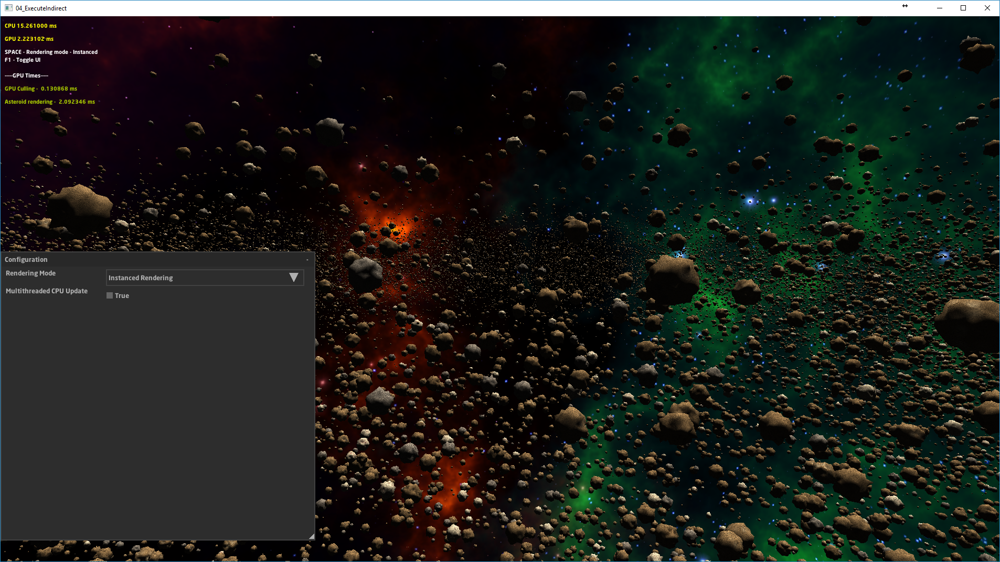
Using Instanced Rendering

## 5. Font Rendering

This unit test shows the current state of our font rendering library that is based on several open-source libraries.

## 6. Material Playground

This unit test will show a wide range of game related materials in the future.

## 7. Hardware Tessellation

This unit test showcases the rendering of grass with the help of hardware tessellation.

## 8. Procedural 
In the spirit of the shadertoy examples this unit test shows a procedurally generated planet.

## 9. Light and Shadow Playground
This unit test shows various shadow and lighting techniques that can be chosen from a drop down menu. There will be more in the future.

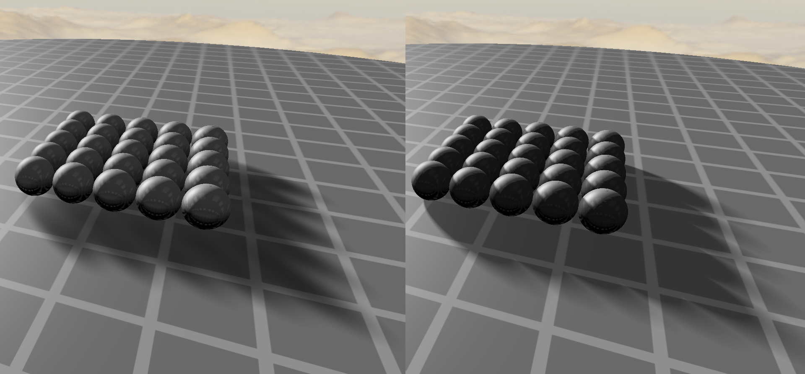

## 9a. Hybrid Ray-Traced Shadows
This unit test was build by Kostas Anagnostou @KostasAAA to show how to ray trace shadows without using a ray tracing API like DXR / RTX. It should run on all GPUs (not just NVIDIA RTX GPUs) and the expectation is that it should run comparable with a DXR / RTX based version even on a NVIDIA RTX GPU. That means the users of your game do not have to buy a NVIDIA RTX GPU to enjoy HRT shadows :-)

## 10. Pixel-Projected Reflections
This unit test shows reflections that are ray traced. It is an implementation of the papers [Optimized pixel-projected reflections for planar reflectors](http://advances.realtimerendering.com/s2017/PixelProjectedReflectionsAC_v_1.92.pdf) and [IMPLEMENTATION OF OPTIMIZED PIXEL-PROJECTED REFLECTIONS FOR PLANAR REFLECTORS](https://github.com/byumjin/Jin-Engine-2.1/blob/master/%5BByumjin%20Kim%5D%20Master%20Thesis_Final.pdf)

## 11. Multi-GPU (Driver support only on PC Windows)
This unit test shows a typical VR Multi-GPU configuration. One eye is rendered by one GPU and the other eye by the other one.

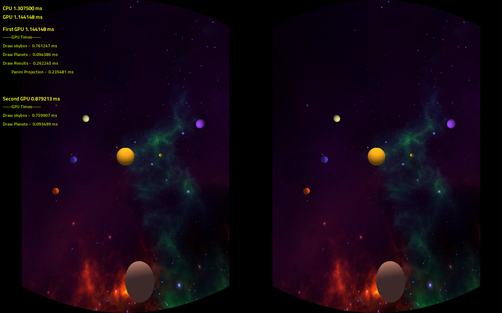

## 12. The Forge switching between Vulkan and DirectX 12 during Run-time (Windows PC-only)
This unit test shows how to switch between the Vulkan and DirectX 12 graphics API during run-time. 

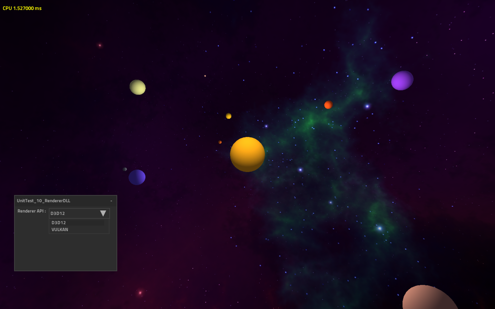

## 13. imGUI integration unit test
This unit test shows how the integration of imGui with a wide range of functionality.

## 14. Order-Independent Transparency unit test
This unit test compares various Order-Indpendent Transparency Methods.

## 15. Wave Intrinsics unit test
This unit test shows how to use the new wave intrinsics. In the moment it only supports DirectX 12 and Vulkan on Windows and with the later on Linux. More platforms will be added.

## 16. Ray Tracing Unit Test for DXR
Ray Tracing API unit test, showing how to use DXR on Windows only.

# Examples
There is an example implementation of the Triangle Visibility Buffer as covered in various conference talks. [Here](https://diaryofagraphicsprogrammer.blogspot.com/2018/03/triangle-visibility-buffer.html) is a blog entry that details the implementation in The Forge.

# Releases / Maintenance
Confetti will prepare releases when all the platforms are stable and running and push them to this GitHub repository. Up until a release, development will happen on internal servers. This is to sync up the console, mobile, macOS and PC versions of the source code.

# Products
We would appreciate it if you could send us a link in case your product uses The Forge. Here are the ones we received so far:

## StarVR One SDK
The Forge is used to build the StarVR One SDK:

## Torque 3D
The Forge is used as the rendering framework in Torque 3D:

# Open-Source Libraries
The Forge utilizes the following Open-Source libraries:
* [Assimp](https://github.com/assimp/assimp)
* [Bullet Physics](https://github.com/bulletphysics)
* [Fontstash](https://github.com/memononen/fontstash)
* [Vectormath](https://github.com/glampert/vectormath)
* [Nothings](https://github.com/nothings/stb) single file libs 
  * [stb.h](https://github.com/nothings/stb/blob/master/stb.h)
  * [stb_image.h](https://github.com/nothings/stb/blob/master/stb_image.h)
  * [stb_image_resize.h](https://github.com/nothings/stb/blob/master/stb_image_resize.h)
  * [stb_image_write.h](https://github.com/nothings/stb/blob/master/stb_image_write.h)
* [shaderc](https://github.com/google/shaderc)
* [SPIRV_Cross](https://github.com/KhronosGroup/SPIRV-Cross)
* [Task Scheduler](https://github.com/SergeyMakeev/TaskScheduler)
* [TinyEXR](https://github.com/syoyo/tinyexr)
* [TinySTL](https://github.com/mendsley/tinystl)
* [Vulkan Memory Allocator](https://github.com/GPUOpen-LibrariesAndSDKs/VulkanMemoryAllocator)
* [GeometryFX](https://gpuopen.com/gaming-product/geometryfx/)
* [WinPixEventRuntime](https://blogs.msdn.microsoft.com/pix/winpixeventruntime/)
* [Fluid Studios Memory Manager](http://www.paulnettle.com/)
* [volk Metaloader for Vulkan](https://github.com/zeux/volk)
* [gainput](https://github.com/jkuhlmann/gainput)
* [Shader Playground](https://github.com/tgjones/shader-playground)
* [hlslparser](https://github.com/Thekla/hlslparser)
* [ImGui](https://github.com/ocornut/imgui)
* [DirectX Shader Compiler](https://github.com/Microsoft/DirectXShaderCompiler)
